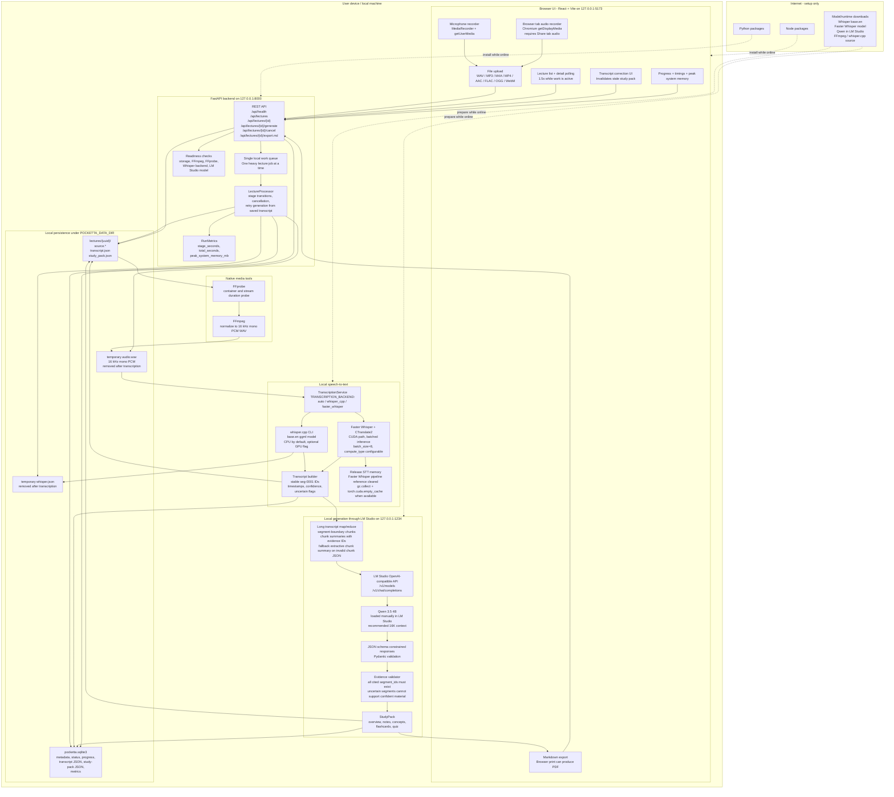
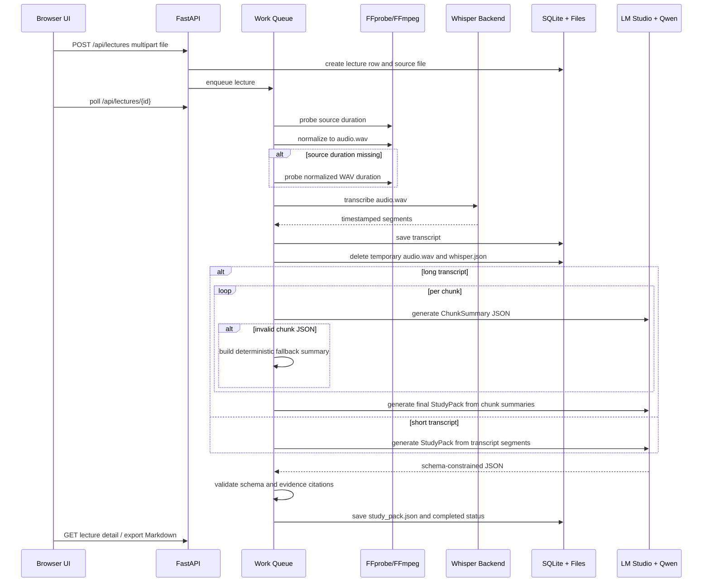

# PocketTA Local Architecture and Technical Report

PocketTA Local is a private lecture-processing app that runs transcription and study-pack generation on a user's own machine. It accepts uploaded or browser-recorded lecture audio, normalizes it locally, transcribes it with a local Whisper runtime, generates evidence-linked notes and practice material through a local LM Studio server, and stores all artifacts in a local SQLite-backed workspace.

## System Diagram



## Data Flow

1. The user uploads a lecture file, records microphone audio in the browser, or records a Chromium browser tab with tab audio sharing enabled.
2. FastAPI streams the upload to `POCKETTA_DATA_DIR/lectures/{uuid}/source.*` while enforcing the configured upload byte limit.
3. The lecture row is created in SQLite with queued status, display filename, optional title, progress, and empty result fields.
4. A single local work queue picks up the lecture. Only one heavy lecture job is processed at a time to avoid competing STT and LLM memory pressure.
5. FFprobe attempts to read duration from both container-level and stream-level duration fields. Browser mic and tab recordings can report `N/A`, so PocketTA can normalize first and then probe the generated WAV duration.
6. FFmpeg converts media to temporary 16 kHz mono PCM WAV, the input expected by the speech backend.
7. `TranscriptionService` selects either whisper.cpp or Faster Whisper:
   - `whisper_cpp`: runs the configured `whisper-cli` executable and parses its JSON output.
   - `faster_whisper`: loads a CUDA CTranslate2 model, wraps it in `BatchedInferencePipeline`, uses batch size 8, and clears the pipeline after transcription.
8. Transcript segments are converted into PocketTA's stable schema: `seg-0001` IDs, timestamps, text, confidence, and `uncertain` flags.
9. The temporary normalized WAV and Whisper scratch JSON are removed after successful transcription. The transcript is saved in SQLite and `transcript.json`.
10. Reliable transcript segments are sent to the local LM Studio server. Uncertain segments remain visible to the user but are excluded from generation prompts.
11. Short transcripts use one schema-constrained generation request. Long transcripts are chunked on segment boundaries, summarized into evidence-linked points, then reduced into a final study pack.
12. Pydantic validates every generated object. The evidence validator rejects unknown segment IDs and citations to uncertain transcript segments.
13. The final study pack is stored in SQLite and `study_pack.json`, then exposed in the UI and Markdown export.
14. The user can edit transcript text. Edits invalidate the generated study pack so regeneration cannot silently use stale evidence.
15. If generation fails after transcription, the user can retry generation from the saved transcript without re-running FFmpeg or STT.
16. Delete cancels owned native work, removes the lecture directory, and deletes the SQLite row.

## Model Pipeline



## Local and Cloud Components

| Component | Runs during normal use | Network used during normal use? | User data leaves device? | Notes |
|---|---:|---:|---:|---|
| React/Vite UI | Local browser | No external network required | No | Connects to FastAPI on loopback. |
| Browser microphone capture | Local browser | No external network required | No | Uses `getUserMedia`; requires user microphone permission. |
| Browser tab audio capture | Chromium-based local browser | No external network required | No | Uses `getDisplayMedia`; the user must select a browser tab and enable "Share tab audio". Firefox and Safari are not currently supported for tab audio capture. |
| FastAPI backend | Local Python process | No external network required | No | Binds to `127.0.0.1`. |
| SQLite | Local file | No | No | Stores metadata, transcript JSON, study-pack JSON, and metrics. |
| FFmpeg / FFprobe | Local native tools | No | No | Used for duration probing and audio normalization. |
| whisper.cpp | Local native executable | No | No | Default/offline STT path when configured. |
| Faster Whisper | Local Python/CTranslate2 runtime | No after setup | No | Optional CUDA STT path; model must already be local or cached. |
| LM Studio | Local app/server | No after setup | No | Must run on loopback; PocketTA rejects non-loopback LM Studio URLs. |
| Qwen 3.5 4B | Local model loaded by LM Studio | No after setup | No | Used for study-pack generation through LM Studio's local API. |
| Package/model download | Setup only | Yes | No lecture data involved | Python, Node, model, FFmpeg, and native runtime setup can require internet. |

PocketTA does not call a hosted AI API, analytics endpoint, CDN, telemetry service, account system, vector database, or remote storage service during normal processing.

## Key Design Decisions

- **Loopback-only architecture:** The UI, backend, and LM Studio all communicate through loopback addresses. `LM_STUDIO_BASE_URL` is validated so it cannot point at a remote host.
- **No cloud AI dependency:** Transcription and generation are local. Internet is a setup dependency, not a runtime dependency.
- **Single heavy-work queue:** STT and LLM workloads can both consume large RAM/VRAM. A single queue avoids simultaneous model contention on student laptops.
- **Browser capture is explicit:** Microphone and tab capture are user-initiated browser permissions. Tab audio is limited to Chromium-based browsers because PocketTA depends on Chromium's tab-audio display-capture support.
- **Evidence-first generation:** Every generated note, concept, flashcard, and quiz question must cite exact transcript segment IDs.
- **Uncertainty filtering:** Low-confidence transcript segments are visible for transparency but excluded from confident study-material generation.
- **Schema-constrained LLM calls:** LM Studio requests include JSON schema response formats, then Pydantic performs local validation.
- **Retryable generation:** A saved transcript is the boundary between STT and generation. Generation can be retried without re-transcribing.
- **Long-transcript chunking:** Inputs above `LM_STUDIO_CHUNK_CHARS` are summarized chunk-by-chunk and reduced into one final pack, keeping prompts within local model context limits.
- **Fallback chunk summaries:** If the LLM returns invalid intermediate chunk JSON, PocketTA builds deterministic extractive chunk points from transcript segments and continues to final generation.
- **Memory handoff between STT and LLM:** Faster Whisper uses batched inference for throughput, then clears its pipeline reference and CUDA cache after transcription so LM Studio has more memory available.
- **Local deletion semantics:** Delete removes both SQLite state and the lecture directory. Temporary normalized audio is removed after transcription.

## Technical Report

### Runtime and Frameworks

| Layer | Technology | Purpose |
|---|---|---|
| Frontend | React 19, Vite 8, TypeScript | Local browser app, upload, recorder, polling, transcript edits, export UI. |
| Backend | Python 3.11, FastAPI, Uvicorn | Local REST API, queue, orchestration, validation. |
| Persistence | SQLite | Durable local lecture state and JSON artifacts. |
| Media | FFmpeg, FFprobe | Decode/probe uploaded media and normalize audio. |
| STT option 1 | whisper.cpp with Whisper `base.en` GGML | Offline English transcription. |
| STT option 2 | Faster Whisper >= 1.1.0 with CTranslate2 | Optional CUDA transcription path. |
| Generation | LM Studio OpenAI-compatible API | Local LLM serving on `127.0.0.1:1234`. |
| Study model | Qwen 3.5 4B | Local structured generation for notes, concepts, flashcards, and quiz. |
| Validation | Pydantic v2 | Model output schemas and evidence constraints. |

### Models and Optimizations

| Model/runtime | Role | Size / class | Optimization details | Loading policy |
|---|---|---:|---|---|
| Whisper `base.en` via whisper.cpp | English speech recognition | Base-size Whisper model; GGML file installed separately | CPU default; optional whisper.cpp GPU flag; 16 kHz mono input | External process loads model per transcription and exits. |
| Faster Whisper `turbo` or local CTranslate2 directory | Optional CUDA speech recognition | Configurable model name/path | `compute_type` configurable; `.env.example` uses `int8`; batched inference with `batch_size=8`; VAD configurable | Loaded for transcription, then pipeline reference is cleared and CUDA cache is released when possible. |
| Qwen 3.5 4B through LM Studio | Study-pack generation | 4B parameter local LLM | LM Studio runtime; recommended 16K context; schema-constrained JSON responses; prompt chunking for long transcripts | Loaded manually in LM Studio; PocketTA does not download or load it automatically. |

### Important Configuration

| Setting | Default/example | Purpose |
|---|---|---|
| `POCKETTA_DATA_DIR` | `./data` | Root for SQLite and lecture artifact directories. |
| `TRANSCRIPTION_BACKEND` | `auto` or `faster_whisper` in the example | Selects `whisper_cpp`, `faster_whisper`, or readiness-based auto selection. |
| `FASTER_WHISPER_COMPUTE_TYPE` | `int8` in example | Reduces CUDA memory use for Faster Whisper. |
| `FASTER_WHISPER_BATCH_SIZE` | `8` | Batched Faster Whisper inference size. |
| `FASTER_WHISPER_VAD_FILTER` | configurable | Enables/disables Faster Whisper VAD. |
| `LM_STUDIO_BASE_URL` | `http://127.0.0.1:1234/v1` | Local LM Studio API endpoint; must be loopback. |
| `LM_STUDIO_MODEL_ID` | `qwen3.5-4b` in example | Exact loaded LM Studio model identifier. |
| `LM_STUDIO_TIMEOUT_SECONDS` | `480` | Long local generation timeout. |
| `LM_STUDIO_CHUNK_CHARS` | `14000` | Character threshold for chunked generation. |
| `LM_STUDIO_CHUNK_OVERLAP_SEGMENTS` | `1` | Segment overlap between long-transcript chunks. |
| `MAX_UPLOAD_MB` | `200` | Upload byte limit. |
| `UNCERTAIN_CONFIDENCE_THRESHOLD` | `0.60` | Below this, transcript segments are flagged uncertain. |
| `TEMPORARY_FILE_MAX_AGE_HOURS` | `24` | Startup cleanup threshold for abandoned temp files. |

### Tested Performance Results

The benchmark runner uploads a recording through the local HTTP API, waits for terminal status, records stage transitions, validates generated evidence, and emits JSON/Markdown reports. It checks completion, evidence resolution, no uncertain evidence citations, summary presence, and expected demo item counts.

| Run | Audio | Device class | Total | Normalization | Transcription | Generation | Output / validation |
|---|---:|---|---:|---:|---:|---:|---|
| Hardened reference run | 10 minutes | 8 GB reference machine | 390.2s | 1.0s | 23.8s | ~365s | 188 segments, 14 notes, 6 concepts, 6 flashcards, 5 quiz questions; all cited IDs resolved; one uncertain segment was not cited. |
| Bundled demo run | 2.5 minutes | Local post-hardening run | 88.4s | 0.5s | 6.1s | 81.7s | 43 segments, 3 concepts, 5 flashcards, 5 quiz questions, 21 distinct valid citations. |

The reported benchmark runs used localhost services. They were not independently captured as Wi-Fi-off runs, so the offline claim should be verified with the offline acceptance checklist before submission/demo.

### CPU, GPU, and Memory Behavior

- FFmpeg/FFprobe use local CPU and disk I/O.
- whisper.cpp CPU mode is the conservative baseline. whisper.cpp GPU mode is configurable but should be smoke-tested on the target machine.
- Faster Whisper uses CUDA when selected. Readiness checks require the package, CTranslate2, CUDA device availability, and a prepared local model.
- Faster Whisper is optimized with configurable compute type and batched inference. The example uses `int8` and batch size 8.
- After Faster Whisper transcription, PocketTA clears its local pipeline reference and calls `gc.collect()`. If PyTorch with CUDA is installed and CUDA is available, it also calls `torch.cuda.empty_cache()`.
- LM Studio memory usage is managed outside PocketTA. The single local queue and STT memory cleanup are intended to reduce contention before Qwen generation begins.
- PocketTA records observed system memory through `psutil.virtual_memory().used` during processing and persists `peak_system_memory_mb` in lecture metrics. This is system-level memory, not exact process RSS or VRAM.

## Evaluation

### Benchmark Method

1. Prepare all runtimes and models while online.
2. Start LM Studio, load Qwen 3.5 4B, start FastAPI, and start Vite.
3. Confirm `/api/health` is ready.
4. Run `scripts/benchmark.py` against a consented recording.
5. The script uploads the file, polls until `completed` or `failed`, records status transitions, validates citations, and writes JSON/Markdown output.
6. For offline acceptance, repeat after disabling Wi-Fi and confirm no runtime dependency attempts to use the internet.

Example:

```bash
mkdir -p benchmark-results
.venv/bin/python scripts/benchmark.py /path/to/consented-sample.mp4 \
  --json-out benchmark-results/sample.json \
  --markdown-out benchmark-results/sample.md
```

### Quality Checks

PocketTA evaluates output quality structurally rather than with a WER or human grading benchmark:

- All generated citations must resolve to real transcript segment IDs.
- Generated material cannot cite uncertain transcript segments.
- The final pack must include an overview and expected study artifact categories.
- Quiz answers must index one of the listed options.
- Pydantic schemas reject malformed model output.
- Transcript edits invalidate stale generated packs and require regeneration.

### Baseline Comparison

| Baseline | PocketTA difference |
|---|---|
| Manual note-taking from recordings | PocketTA produces a first draft transcript, notes, flashcards, and quiz with linked evidence, reducing manual extraction time. |
| Hosted cloud transcription and hosted LLM summarization | PocketTA keeps lecture audio and generated artifacts local during normal use and does not require accounts or cloud uploads. |
| Single prompt over entire long transcript | PocketTA chunks long transcripts and preserves evidence IDs through a map/reduce flow to reduce context pressure. |
| Unvalidated local LLM output | PocketTA validates JSON schemas and evidence citations before accepting a study pack. |

No formal word-error-rate benchmark, human preference study, or head-to-head quantitative baseline has been completed. The current evaluation is functional, evidence-consistency, and latency oriented.

### Known Failure Cases

- Poor microphone quality, overlapping speakers, heavy accents, music, or background noise can reduce transcription quality.
- The current product is English-focused; non-English lectures are not a validated target.
- Diarisation is intentionally omitted, so speakers are not separated.
- Local LLMs can omit content, produce shallow summaries, or fail JSON validation. PocketTA retries and validates, but generated study material still needs review.
- Very long recordings can exceed local model context, timeout, RAM, or VRAM limits despite chunking.
- If all transcript segments are uncertain, generation stops rather than inventing unsupported material.
- Browser mic and tab-recording containers can omit duration metadata; PocketTA now falls back to probing the normalized WAV, but corrupt media can still fail.
- Browser tab audio capture currently requires Chrome, Edge, or another Chromium-based browser. The user must choose a browser tab, not a window or full screen, and enable "Share tab audio".
- LM Studio must be manually started with the correct local model loaded.
- The app is designed for one local user, not multi-user concurrent workloads.

## Local AI Verification

### Fully On-Device During Normal Processing

- Upload handling and storage.
- Media normalization with FFmpeg/FFprobe.
- Transcription with whisper.cpp or Faster Whisper.
- Transcript confidence processing and uncertainty filtering.
- Prompt construction, chunking, validation, and evidence checks.
- Study-pack generation through LM Studio on loopback.
- SQLite persistence, Markdown export, deletion, cancellation, and retry.

### Requires Internet Access

- Initial dependency installation from Python and Node package registries.
- Installing FFmpeg if not already available.
- Cloning/building whisper.cpp if using that backend.
- Downloading the Whisper `base.en` model.
- Installing optional Faster Whisper dependencies and preparing/downloading the configured Faster Whisper model.
- Installing LM Studio and downloading Qwen 3.5 4B.
- Accessing source documentation or the MIT OCW sample source page.

### User Data Egress

PocketTA is designed so lecture audio, transcripts, corrections, generated study packs, and metrics do not leave the device during normal processing. The backend binds to loopback, LM Studio is restricted to loopback, and HTTP clients use `trust_env=False` for model calls so proxy environment variables are not used for LM Studio traffic.

## Privacy and Safety

### Data Handling

- Original uploads are stored under `POCKETTA_DATA_DIR/lectures/{uuid}/source.*`.
- SQLite stores lecture metadata, progress, metrics, transcript JSON, and study-pack JSON.
- `transcript.json` and `study_pack.json` are also written in the lecture directory for transparency and recovery.
- Normalized `audio.wav` and temporary Whisper JSON are removed after successful transcription.
- Startup cleanup removes abandoned temporary files older than the configured threshold.
- Delete removes the lecture directory and SQLite row.

### Permissions

- Browser microphone permission is required only for microphone recording.
- Browser tab recording requires screen/tab capture permission in a Chromium-based browser and explicit "Share tab audio" selection. PocketTA records only the returned audio track, not the video track.
- File upload uses standard browser file selection or drag/drop.
- The backend does not require accounts, cloud credentials, or persistent network permissions.
- Local filesystem access is limited to configured project/data paths and native tool execution.

### Safety Limitations and Risks

- Generated notes and quizzes can be incomplete or wrong. Users should inspect the cited transcript evidence.
- Transcripts may contain errors, especially for noisy or specialized audio.
- Browser tab capture can record copyrighted or private playback if the user chooses such a tab. Users are responsible for recording only content they have permission to process.
- The app reduces disclosure risk but is not a formal security proof.
- Anyone with access to the local machine and `POCKETTA_DATA_DIR` may access stored recordings and generated artifacts unless the OS protects that directory.
- The bundled demo media is CC BY-NC-SA and is not covered by the project's MIT software license.
- The system does not perform malware scanning on uploaded files; FFmpeg handles media parsing locally.

## Attribution

| Component | Role | License/source | Included in repo? |
|---|---|---|---|
| PocketTA Local application code | Product implementation | MIT license in `LICENSE` | Yes |
| React | Frontend UI library | MIT | Installed as dependency |
| Vite | Frontend dev/build tool | MIT | Installed as dependency |
| FastAPI | Backend API framework | MIT | Installed as dependency |
| Uvicorn | ASGI server | BSD-3-Clause | Installed as dependency |
| Pydantic / pydantic-settings | Data validation and settings | MIT | Installed as dependency |
| httpx | Local HTTP client for LM Studio | BSD-3-Clause | Installed as dependency |
| psutil | System memory metrics | BSD-3-Clause | Installed as dependency |
| SQLite | Local database | Public domain | Runtime dependency through Python |
| FFmpeg / FFprobe | Media decode, probe, normalization | LGPL/GPL depending build | External install |
| whisper.cpp | Local Whisper runtime | MIT | External build |
| Whisper `base.en` | Speech model | OpenAI Whisper model release | External model |
| Faster Whisper | Optional STT runtime | MIT | Optional dependency |
| CTranslate2 | Faster Whisper inference engine | MIT | Optional dependency |
| LM Studio | Local LLM server | LM Studio terms | External app |
| Qwen 3.5 4B | Local study-pack generation model | Apache-2.0 model card | External model |
| MIT OpenCourseWare 6.0001 sample excerpt | Bundled demo media | CC BY-NC-SA 4.0 | Yes, as sample media |

Dependencies retain their own licenses. Model weights and native runtimes must be installed separately unless explicitly present in the repository. The MIT OCW sample is documented in `samples/README.md` and remains under its original Creative Commons license.
